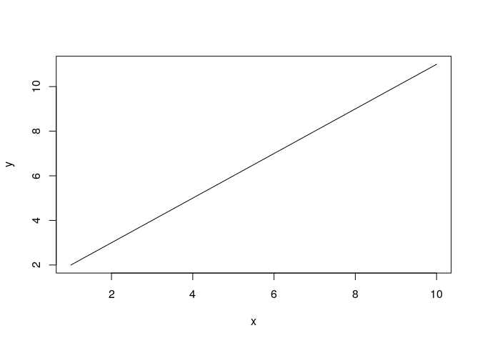

# Before Started
This is an introduction to R, specifically for people who have a little knowledge in programming and unfamiliar with R. This tutorial is application oriented, and it's focused on aspects for psychologists to perform data analysis and plotting in R.
The following is the tutorial. The assignments are also included in the assignment page. check https://rpubs.com/naszhu/start1 and https://rpubs.com/naszhu/assignment for complied rmd files.

# A start: Get use to R 
(Partially credit to Nicole Kelbick, PhD. and introduction to R https://cran.r-project.org/doc/manuals/r-release/R-intro.pdf)

Don't afriad to use R. It can be very simple. You can start by open R and type in only one line, and it will work. Try the following:

(The ones with ** are frequently used)

## Common used operation or funtions

### ** ":"
The operator ':' generates a sequence of integers. 

```r
1:10
```

```
##  [1]  1  2  3  4  5  6  7  8  9 10
```

```r
10:1
```

```
##  [1] 10  9  8  7  6  5  4  3  2  1
```

### "<-" or "="
You can assign values to variables using '<-' OR '='.

```r
x <- 5
x
```

```
## [1] 5
```

```r
x=2
x
```

```
## [1] 2
```

### "+" "-" "*" "/" "%%"
These are basic arithmetic operations 

```r
x+5
```

```
## [1] 7
```

```r
x*5
```

```
## [1] 10
```

```r
x/5
```

```
## [1] 0.4
```

```r
x%%5 #give the remainder of x
```

```
## [1] 2
```

### ** "seq(from,to,spacing)" 
The 'seq' function generates a sequence of numbers with a specified spacing.\
seq( from,to,spacing)

```r
xn <- seq(1,10,.1)
xn
```

```
##  [1]  1.0  1.1  1.2  1.3  1.4  1.5  1.6  1.7  1.8  1.9  2.0  2.1  2.2  2.3  2.4
## [16]  2.5  2.6  2.7  2.8  2.9  3.0  3.1  3.2  3.3  3.4  3.5  3.6  3.7  3.8  3.9
## [31]  4.0  4.1  4.2  4.3  4.4  4.5  4.6  4.7  4.8  4.9  5.0  5.1  5.2  5.3  5.4
## [46]  5.5  5.6  5.7  5.8  5.9  6.0  6.1  6.2  6.3  6.4  6.5  6.6  6.7  6.8  6.9
## [61]  7.0  7.1  7.2  7.3  7.4  7.5  7.6  7.7  7.8  7.9  8.0  8.1  8.2  8.3  8.4
## [76]  8.5  8.6  8.7  8.8  8.9  9.0  9.1  9.2  9.3  9.4  9.5  9.6  9.7  9.8  9.9
## [91] 10.0
```

```r
seq(1,10,length.out = 20) #use length.out to specify how many you need within the range
```

```
##  [1]  1.000000  1.473684  1.947368  2.421053  2.894737  3.368421  3.842105
##  [8]  4.315789  4.789474  5.263158  5.736842  6.210526  6.684211  7.157895
## [15]  7.631579  8.105263  8.578947  9.052632  9.526316 10.000000
```

### "rev"
The 'rev' function reverses values of argument.


```r
yn <- rev(xn)
yn
```

```
##  [1] 10.0  9.9  9.8  9.7  9.6  9.5  9.4  9.3  9.2  9.1  9.0  8.9  8.8  8.7  8.6
## [16]  8.5  8.4  8.3  8.2  8.1  8.0  7.9  7.8  7.7  7.6  7.5  7.4  7.3  7.2  7.1
## [31]  7.0  6.9  6.8  6.7  6.6  6.5  6.4  6.3  6.2  6.1  6.0  5.9  5.8  5.7  5.6
## [46]  5.5  5.4  5.3  5.2  5.1  5.0  4.9  4.8  4.7  4.6  4.5  4.4  4.3  4.2  4.1
## [61]  4.0  3.9  3.8  3.7  3.6  3.5  3.4  3.3  3.2  3.1  3.0  2.9  2.8  2.7  2.6
## [76]  2.5  2.4  2.3  2.2  2.1  2.0  1.9  1.8  1.7  1.6  1.5  1.4  1.3  1.2  1.1
## [91]  1.0
```


### ** "c(elem1,elem2)"
The operator 'c'combines different elements into a vector

```r
c(1,2)
```

```
## [1] 1 2
```

```r
c("1",2) #the same as c("1","2"), they are all stored as strings. 
```

```
## [1] "1" "2"
```

### ** rep(arg1,n)
'rep(arg1, n)' repeats the first argument (arg1) n times

```r
rep(2,7)
```

```
## [1] 2 2 2 2 2 2 2
```

```r
y <- c(1, 3, 5.5, rep(2,7))
y
```

```
##  [1] 1.0 3.0 5.5 2.0 2.0 2.0 2.0 2.0 2.0 2.0
```

```r
rep(c(1,3),3) # repeat 1,3 for 3 times
```

```
## [1] 1 3 1 3 1 3
```

```r
rep(seq(1,3),2:4) # repeat 1,2,3 correspondingly for 2,3,4 times
```

```
## [1] 1 1 2 2 2 3 3 3 3
```

### Type casting: as.numeric and etc.
Change string to number; or change number to string 

```r
as.numeric("1") #when you add  " " , the content in the double quotation marks become strings
```

```
## [1] 1
```

```r
as.character(1)
```

```
## [1] "1"
```

### ";"
The operator ";" can be used as a seperation for each command when writing on the same line

```r
print(x);print(y)
```

```
## [1] 2
```

```
##  [1] 1.0 3.0 5.5 2.0 2.0 2.0 2.0 2.0 2.0 2.0
```

### "mean";"var";"sd","median"

```r
x=1:10;x
```

```
##  [1]  1  2  3  4  5  6  7  8  9 10
```

```r
mean(x) #Get average
```

```
## [1] 5.5
```

```r
median(x) #Get median
```

```
## [1] 5.5
```

```r
var(x) #Get variation
```

```
## [1] 9.166667
```

```r
sd(x) #Get Standard deviation
```

```
## [1] 3.02765
```

### "paste(elm1,elm2,sep)"
the paste(element1,element2,sep="") function combines elements into strings

```r
paste("Day",1:10,sep="")
```

```
##  [1] "Day1"  "Day2"  "Day3"  "Day4"  "Day5"  "Day6"  "Day7"  "Day8"  "Day9" 
## [10] "Day10"
```

```r
paste("Day",1:10,sep="_")
```

```
##  [1] "Day_1"  "Day_2"  "Day_3"  "Day_4"  "Day_5"  "Day_6"  "Day_7"  "Day_8" 
##  [9] "Day_9"  "Day_10"
```

```r
paste(c("X","Y"), 1:10, sep="")
```

```
##  [1] "X1"  "Y2"  "X3"  "Y4"  "X5"  "Y6"  "X7"  "Y8"  "X9"  "Y10"
```


## Logical expressions 

### or "|" "||"


When comparing single value, you may use  "|" or "||"  

```r
x=2;y=3
y > 0 | x >= 3
```

```
## [1] TRUE
```

```r
y > 0 || x >= 3
```

```
## [1] TRUE
```
When comparing a vector, you use "|" to gain results of comparison by array 

```r
a=1:3;b=2:4
a>b | a==b
```

```
## [1] FALSE FALSE FALSE
```
"||" gives only a single logic value when comparing a vetor  

```r
a>b || a==b
```

```
## [1] FALSE
```

### and "&" "&&"

```r
a>b & a==b
```

```
## [1] FALSE FALSE FALSE
```

```r
y > 0 && x >= 3
```

```
## [1] FALSE
```


## About functions
### Find help "?"
Find help/example/instruction for function, add a "?" before the function name:

```r
?print
```


Use single quotes to get help on operators

```r
?`:`
```


These helping information in the picture above will show up on the sidebar of R studio


### "args": View arguments of function 
To view the list of possible arguments a function can have use 'args'

```r
args(png) #png is a function to export graph as png in your computer
```

```
## function (filename = "Rplot%03d.png", width = 480, height = 480, 
##     units = "px", pointsize = 12, bg = "white", res = NA, ..., 
##     type = c("cairo", "cairo-png", "Xlib", "quartz"), antialias) 
## NULL
```
### View the whole function
To see the whole function: type in the function name without "()" followed 

```r
var
```

```
## function (x, y = NULL, na.rm = FALSE, use) 
## {
##     if (missing(use)) 
##         use <- if (na.rm) 
##             "na.or.complete"
##         else "everything"
##     na.method <- pmatch(use, c("all.obs", "complete.obs", "pairwise.complete.obs", 
##         "everything", "na.or.complete"))
##     if (is.na(na.method)) 
##         stop("invalid 'use' argument")
##     if (is.data.frame(x)) 
##         x <- as.matrix(x)
##     else stopifnot(is.atomic(x))
##     if (is.data.frame(y)) 
##         y <- as.matrix(y)
##     else stopifnot(is.atomic(y))
##     .Call(C_cov, x, y, na.method, FALSE)
## }
## <bytecode: 0x558f4e3add18>
## <environment: namespace:stats>
```


### Get/set Working dictionary: "getwd()" "setwd()"
Get current working dictionary:

```r
getwd()
```

```
## [1] "/home/shulai/Insync/shulai@iu.edu/Google Drive/CAIDE Lab/R-tt"
```

Set current working dictionary:

```r
setwd("C:/Users/naszh/Desktop")
```

As we started, (e.x.: a=c(1,2,...)) is a way to combine elelments and create vectors. There also are other ways to create vectors:

## vector or array

Create vector or array

```r
x=vector()
x[3]=10
x
```

```
## [1] NA NA 10
```

```r
y=array()
y[4]=1
y
```

```
## [1] NA NA NA  1
```
Difference between array and vector is that array can have more dimensions than vector:


```r
array(dim=c(1,2))
```

```
##      [,1] [,2]
## [1,]   NA   NA
```
dim stands for dimension at here.

### Assign names for a vector or array
Vectors can have names for each element, and array can have column names and row names

```r
x=1:10 #x become a vector
names(x)=paste("X",1:10,sep="")
x
```

```
##  X1  X2  X3  X4  X5  X6  X7  X8  X9 X10 
##   1   2   3   4   5   6   7   8   9  10
```

```r
y=array(2:3,dim=c(1,2))
colnames(y)=c("col1","col2") #define column names
rownames(y)="row1" #define row names
y
```

```
##      col1 col2
## row1    2    3
```
### Call elements in vector or array
call by names (use x and y value from above)

```r
x["X1"] #don't forget to add " " on the name inside []
```

```
## X1 
##  1
```

```r
y["row1","col1"]
```

```
## [1] 2
```
Call by index number

```r
#vector:
x=1:10
x
```

```
##  [1]  1  2  3  4  5  6  7  8  9 10
```

```r
x[1]
```

```
## [1] 1
```

```r
x[1:2]
```

```
## [1] 1 2
```

```r
#array:
y=array(1:20,dim=c(4,5))
y
```

```
##      [,1] [,2] [,3] [,4] [,5]
## [1,]    1    5    9   13   17
## [2,]    2    6   10   14   18
## [3,]    3    7   11   15   19
## [4,]    4    8   12   16   20
```

```r
y[2,3] #row2, column 3
```

```
## [1] 10
```

```r
y[2, ] #present row 2
```

```
## [1]  2  6 10 14 18
```


### Select only certain things in the array

```r
x=1:10
x[x>5]
```

```
## [1]  6  7  8  9 10
```
"x>5" is a logical statement and give an array of logical vlaues:

```r
x>5
```

```
##  [1] FALSE FALSE FALSE FALSE FALSE  TRUE  TRUE  TRUE  TRUE  TRUE
```
This logical value array can be put into  

##Dataframe

create dataframe:

```r
d = data.frame("Feature1" = c(1,10,rep(12,2)))
d
```

```
##   Feature1
## 1        1
## 2       10
## 3       12
## 4       12
```

Call a column:

```r
d$Feature1
```

```
## [1]  1 10 12 12
```

Add a column:

```r
d = cbind(d, "Feature2" = c(10,29,9,2)) #cbind stand for column bind;
    #similarly, rbind is for row bind. 
d
```

```
##   Feature1 Feature2
## 1        1       10
## 2       10       29
## 3       12        9
## 4       12        2
```


##Ploting

### "plot"
You can plot data using the function 'plot'

```r
x = 1:10;y=2:11
plot(x,y)
```

<!-- -->

### Export plot: "pdf", "png"
Export plot  as a pdf (or other formats).

```r
pdf(file="homework1_plot2.pdf", height=3, width=3)
plot(y,x)
plot(x,x)
dev.off()
```

```
## png 
##   2
```

```r
  #Run these functions together
  #the first commend "pdf" startsthe graphics device to pdf, 
  #and the following graphics would be produced in the pdf  
  #When finish plotting, use dev,off to turns off the connection to the graphical device.
  #The file will show up in whatever your current working directory is.
```


### Change font size: "plot(... , lwd= )"
Use larger font for axis labels

```r
plot(x, y, type='l', lwd=8)
```


```r
plot(x, y, type='l', lwd=3)
```


### Change font color: "plot(... , col= )"

```r
plot(x, y, type='l', lwd=8, col='blue')
```


### Change type of plot: "plot(..., type= )" 

```r
plot(x, y, type='l') # "l" for lines
```



```r
plot(x, y, type='p') # "p" for points
```


```r
plot(x, y, type='b') # "b" for both
```


More types usage see "?plot"

### Change title/ lab names

```r
plot(x, y, type='l',xlab="Time",ylab="Grade",main="Time-Grade",sub="Plot 1")
```


